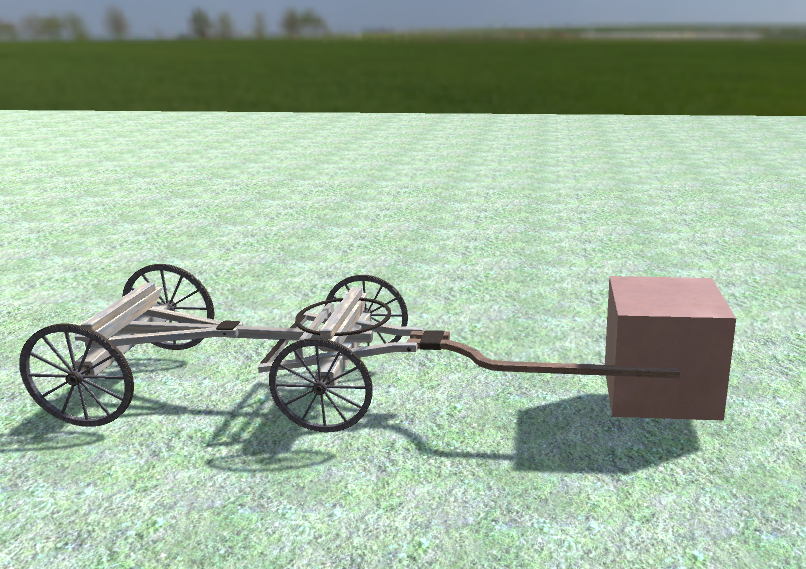

# CartPhysics
Unity physics setup for a cart/wagon pulled by another force

The Unity physics for a car with rigidbodies and wheel colliders work for a self-powered car, i.e. one axis is marked as a motor and drives the car while the other or others are passive. I got this working following the Unity tutorial.

For a RPG I wanted to have a physics-aware wagon and initially followed the same approach as with the car physics. I marked both axis as passive and applied an external motor, a force that pulls the cart and should make the wheels turn. I ran into two major problems:

a) The front wheels on a cart are usually fixed on an axis that turns near its center of mass unlike a car that has one pivot for each wheel. I couldn't get the wheel collider work correctly with this pivot offset.
b) When none of the wheels have a motor i.e. a force applied to them I could move the rigidbody by applying a force but the wheel colliders disregard the velocity. In short I couldn't get the wheels rotating.

These problems and the curiosity of how such a physics setup should work made me create my own scripts for applying the force and get the combo of motor (horse) front part and rear part moving.

